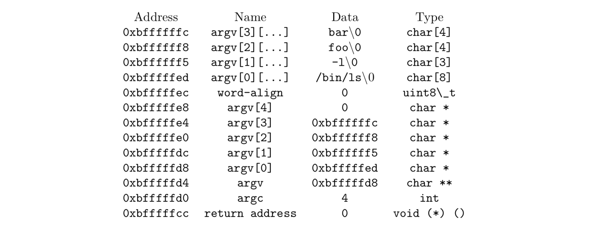

\# Final Report for Project 2: User Programs

## Group Members

- Danning XIE <11510718@mail.sustc.edu.cn>

  Task 2 implement with Ziqiang LI and Task 1 design and implement.

- Ziqiang LI <11510352@mail.sustc.edu.cn>

  Task 2 implement with Danning XIE and Task 3 design and implement, report writing.

## 1 Task 1: Argument Passing

### 1.1 Data structures and functions

#### 1.1.1 Data structures

- <process.c> 
  - New macro `# define WORD_SIZE 4`
- <thread.h>
  - Add new attributes to the `struct thread` : `struct file *self`

#### 1.1.2 Functions

The functions involved in this process is 

- <process.c> : 
  - `process_execute (const char *file_name)`
  -  `load (const char *file_name, void (**eip) (void), void **esp)`
  - `setup_stack (void **esp, char * file_name)`
  - `process_wait (tid_t child_tid)`
- <syscall.c>
  - `syscall_write(struct intr_frame *f);`

Note that `process_wait (tid_t child_tid)` and `syscall_write(struct intr_frame *f);` are really task2 and task3's job. So we won't get into much details in this section.

The tokenize process of `char *` is implemented by calling `strtok_r`.

### 1.2 Algorithms

#### 1.2.1 Analysis

The forward process of how we create a new process:

- calling method <process.c> `process_execute`
- the operating system then ask for a corresponding room of memory
- create a child process of the current one by calling function <thread.c> `thread_create` and pass a function pointer of `load` to it.
- In function `load` , it loads an ELF executable from the `file_name` parameter passed in, stores the executable's entry point into `*eip` and its initial stack pointer into `*esp` by calling function `setup_stack` . 

Therefore, the main work we have to do in this task is to pass the command-line argument into the `load` and `setup_stack`, then push the arguments in correct order into the stack by operating on the stack pointer `*esp`.

#### 1.2.2 Implementation

#### 1.2.2.1 Split and Pass the arguments

The `file_name` passed into function `process_execute (const char *file_name) ` include both executable file and the argument. Therefore, the first thing we need to do is to split the executable file name and the argument.

- <process.c/process_execute> Split the thread name and save it in the variable `chr * thread_name`

  ```c
  char *save_ptr;
  thread_name = malloc(strlen(file_name)+1);
  strlcpy (thread_name, file_name, strlen(file_name)+1);
  thread_name = strtok_r (thread_name," ",&save_ptr); 
  ```

  Then create a child thread

  `tid = thread_create (thread_name, PRI_DEFAULT, start_process, fn_copy);`

- <process.c/start_process>

  pass the `file_name` into the function `load`:

  `success = load (file_name, &if_.eip, &if_.esp);`

- <process.c/load> Split the executable file name and open the file

  and then store the executable file into the current thread :

- <process.c/load> call `setup_stack` and pass the `file_name` 

- <process.c/setup_stack> In this method, we split the `argv` , count the `argc` and then push them in the correct order according to the figure below in the document.

  

  - First tokenize the `file_name`

  - Iterate the token and count the `argc` (argument count)

  - ask for the coresponding size of room for `argv[]`

  - push the element of argv, word align. Also make sure the `argv[argc]` is a null pointer. Push the address of `argv` and finally a return address.

    Note that we simply move the `*esp` (stack pointer) instead of pushing null value/pointer and return address.

### 1.3 Synchronization

During the function `laod`, we allocate page directory for the file, open the file, push the argument into the stack. According to **Task3**, the file operation syscalls do not call multiple filesystem functions concurrently. Therefore, we have to keep the file from modified or opened by other processes. We implement it by using `filesys_lock` (defined in `thread.h` which we will explain in **Task3**):

```c
lock_acquire(&filesys_lock);
//loading the file
lock_release(&filesys_lock);
```

Also, according to the **Task3**, while a user process is running, the operating system must ensure that nobody can modify its executable on disk. `file_deny_write(file)` denies writes to this current-running files.  

### 1.4 Rationale

In this task, we split the input arguments and pass them into function `load` to push the arguments into the stack in the corret order. We also implement lock operations to ensure that nobody can operates on the file. `file_deny_write` is also called to pass the "rox" tests.

## Task 2: Process Control Syscalls

### Data structures and functions

### Algorithms

### Synchronization

### Rationale

## Task 3: File Operation Syscalls

### Data structures and functions

#### syscall.c

- `static void syscall_handler (struct intr_frame *)`

  Handling the file syscall, going to the specific calls by the values in the stack.

- specific file syscall functions

  Call the appropriate functions in the file system library.

  ```c
  void syscall_exit(struct intr_frame *f);
  int syscall_exec(struct intr_frame *f);
  int syscall_wait(struct intr_frame *f);
  int syscall_creat(struct intr_frame *f);
  int syscall_remove(struct intr_frame *f);
  int syscall_open(struct intr_frame *f);
  int syscall_filesize(struct intr_frame *f);
  int syscall_read(struct intr_frame *f);
  int syscall_write(struct intr_frame *f);
  void syscall_seek(struct intr_frame *f);
  int syscall_tell(struct intr_frame *f);
  void syscall_close(struct intr_frame *f);
  ```

- `void * is_valid_addr(const void *vaddr)`

  Verifying `VADDR` is a user virtual address and is located in the current thread page.

- `void pop_stack(int *esp, int *a, int offset)`

  All pop operation on the stack needs to call this function. It will verify if the stack pointer is a valid user-provided pointer, then dereference the pointer.

- `int exec_process(char *file_name)`

  Sub-function invoked by `int syscall_exec()`: split string into tokens and call `process_execute()` with tokens.

- `void exit_process(int status)`

  Sub-function invoked by `int syscall_exit()`: set current thread status by `status`, and update the status of the child(current) process in its parent process. At last, call `thread_exit()`.

- `struct process_file* search_fd(struct list* files, int fd)`

  Find file descriptor and return process file struct in the process file list, if not exist return NULL.

- `void clean_single_file(struct list* files, int fd)`

  Go through the process file list, and close specific process file by the file descriptor number.

- `void clean_all_files(struct list* files)`

  Go through the process file list, and close all process file. Do this when exit a process.

### Algorithms

### Synchronization

### Rationale

## Design Changes

## Reflection

### What did each memebr do

In this project, Zhihao DAI is responsible for implementing Task 1 and designing as well as implementing Task 3. Ziqiang LI is responsible for implementing Task 1 and Task 2 and designing Task 3.

Both members spent a great amount of time debugging the Pintos system with `printf()` and gdb.

### What went well and wrong